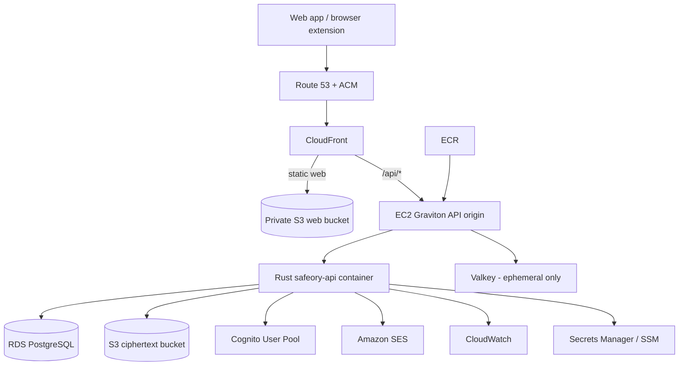

# AWS Production Infrastructure

Status: production deployment target. The local Docker Compose stack remains a
development/integration environment; AWS is the intended hosted production
environment for Safeory.

## Goals

The first production topology is intentionally small enough for roughly the
first 100 active users while preserving the security boundaries required by a
zero-knowledge vault. It must be possible to scale the same protocol and data
model without moving vault decryption or usable vault keys to the server.

The target is low fixed monthly cost, simple operations, encrypted backups, and
a clear upgrade path to multi-AZ/managed compute as usage grows. AWS pricing
changes over time, so cost figures are planning estimates rather than an
architectural contract.

## What remains local to the user device

These responsibilities do **not** move to AWS:

- master-passphrase processing and Argon2id key derivation;
- AccountRootKey, per-item keys, attachment keys, and recovery secrets;
- vault/item/attachment plaintext encryption and decryption;
- local unlocked search and password/TOTP calculations that do not require a
  network service;
- the unlocked WASM session and same-tab reload-resume capability;
- plaintext export/import processing before encrypted data is uploaded.

AWS receives only the server-visible metadata documented in
`docs/security/server-visible-metadata.md` plus opaque ciphertext objects.

## Launch topology: first ~100 users

### Edge, DNS, TLS, and static web

- **Route 53** owns production DNS.
- **ACM** issues/renews public TLS certificates used by CloudFront and any
  HTTPS origin endpoint.
- **CloudFront** is the public web/API edge. The default behavior serves the
  static Next.js export from a private S3 bucket. `/api/*` is routed to the API
  origin so the browser can keep a same-origin CSP/network model.
- **S3 web bucket** stores only built static web assets. It is private and
  readable through CloudFront Origin Access Control rather than public bucket
  access.
- The current local Caddy `handle_path /api/*` behavior strips the `/api`
  prefix before the Rust routes. The AWS API origin must preserve that external
  contract, either with the origin proxy or an equivalent reviewed rewrite.

### Compute

- **EC2 Graviton (`t4g.small` class initially)** runs the Rust API container and
  background worker responsibilities for the launch-sized deployment.
- The API image is built in CI and stored in **Amazon ECR**.
- The instance is managed through **AWS Systems Manager**; routine operations
  must not depend on an exposed SSH port.
- The API origin is not a general-purpose public host. Restrict inbound traffic
  to the intended CloudFront origin path/security controls and expose only the
  required HTTPS listener.
- Do not introduce an ALB, ECS cluster, Kubernetes/EKS, or NAT Gateway merely
  for the first 100-user deployment. Those become justified when availability,
  deployment concurrency, or network isolation requirements require them.

### PostgreSQL

- **Amazon RDS for PostgreSQL** is the authoritative durable server database.
- Start with a small Graviton instance class (`db.t4g.micro` class where
  supported), Single-AZ, encrypted storage, automated backups, deletion
  protection, and private database subnets.
- RDS stores account/device/auth-routing metadata, opaque sync metadata,
  revisions, idempotency state, audit/security workflow metadata, and later
  trusted-person/emergency policy state. It never stores vault plaintext or a
  usable vault key.
- Schema migrations remain source-controlled under `apps/api/migrations` and
  run as an explicit deployment step before the new API version receives
  traffic.

### Ciphertext object storage

- **Amazon S3** replaces Garage in production while preserving the existing
  S3-compatible object-store boundary.
- Use a dedicated private bucket for encrypted vault objects/attachments, with
  block-public-access enabled, versioning/lifecycle rules as appropriate, and
  encryption at rest in addition to Safeory's client-side ciphertext.
- Browser clients never receive AWS credentials for this bucket. Access is
  mediated by the API or narrowly scoped presigned operations when the protocol
  explicitly adds them.

### Authentication and device identity

- **Amazon Cognito User Pools** is the planned hosted account identity layer:
  signup/sign-in, verified email, account sessions, and later MFA/passkey
  integration where supported by the Safeory product flow.
- Cognito account identity does **not** replace Safeory's cryptographic device
  identity. Each authorized device still has its X25519 public key and a
  revocable Safeory device credential used by the sync protocol.
- The current `ACCOUNT_REGISTRATION_TOKEN` bootstrap flow is development-stage
  infrastructure and must not be the public production account-registration
  mechanism.
- The API binds authenticated Cognito accounts to Safeory account/device rows;
  authorization remains account-scoped server-side and never trusts a caller-
  supplied account ID.

### Email

- **Amazon SES** sends verification, security-event, invitation, and emergency-
  workflow notifications.
- Email must never contain vault item names/values, attachment plaintext,
  recovery secrets, or usable decryption material.
- Mailpit remains local-development tooling only.

### Valkey and background work

- Valkey is strictly ephemeral: rate-limit counters, retry coordination,
  deduplication windows, and worker wakeups.
- For the first ~100 users, Valkey may run as a container on the AWS API host
  because loss of this state must never invalidate durable authorization or
  emergency-policy correctness.
- Move Valkey to **Amazon ElastiCache for Valkey** when availability, memory,
  independent scaling, or operational requirements justify the additional
  fixed cost.
- PostgreSQL remains the durable source of truth for any security-sensitive
  state transition.

### Secrets and encryption

- Use **AWS Secrets Manager and/or SSM Parameter Store** for database
  credentials, application secrets, SES/configuration values, and other
  deployment secrets. Do not put production secrets in Git, AMIs, container
  images, or frontend environment variables.
- Use IAM instance/task roles instead of long-lived AWS access keys wherever
  possible.
- RDS and S3 use AWS encryption at rest as defense in depth. This does not
  replace Safeory's client-side encryption.

### Networking

- One VPC spans at least two Availability Zones even if the initial API/RDS
  deployment is not fully multi-AZ.
- RDS lives in private database subnets and accepts PostgreSQL only from the API
  security group.
- The launch API host may live in a public subnet so outbound package/service
  access does not require a NAT Gateway. Inbound access is tightly restricted;
  the application is reached through CloudFront, not by advertising the origin
  as the product endpoint.
- Prefer an S3 VPC gateway endpoint when it simplifies private object traffic
  without adding a NAT dependency.

### Observability and audit

- **CloudWatch Logs/Metrics/Alarms** covers API health, error rates, resource
  pressure, RDS health, backup failures, and deployment failures.
- Log retention must be explicit and bounded.
- Authorization headers, bearer/device tokens, ciphertext request bodies,
  recovery material, and vault plaintext are prohibited from application,
  proxy, and CloudWatch logs.
- AWS account-level audit/changes should be captured with CloudTrail when the
  production account is established.

## CI/CD and infrastructure as code

- GitHub Actions uses **OIDC federation to AWS**; do not store long-lived AWS
  deploy keys in repository secrets.
- Web deployment: build/test -> upload immutable static assets to the private
  S3 web bucket -> update/invalidate CloudFront as needed.
- API deployment: build/test -> publish versioned image to ECR -> run database
  migrations -> deploy the versioned API container -> pass health checks.
- Production infrastructure must be reproducible as code under `infra/aws/`.
  The exact IaC implementation is a deployment task; the AWS service boundaries
  in this document are the architectural contract.
- Rollback must use immutable web/API build versions and must never roll the
  database schema backward in a way that an older client/server cannot safely
  interpret.

## Backup and recovery

- Enable RDS automated backups and test point-in-time recovery.
- Enable S3 versioning/lifecycle policy appropriate to ciphertext objects and
  explicitly document deletion semantics before trusted-person/destruction
  workflows ship.
- Keep infrastructure configuration and migration history in Git.
- Perform a restore drill before calling the AWS deployment production-ready:
  restore PostgreSQL, restore/reconcile ciphertext objects, start a clean API,
  and prove an authorized client can sync/decrypt its own data without the
  server receiving plaintext.

## Cost posture

For the first ~100 users the architecture is intentionally optimized to keep
fixed AWS spend low. The planning target is roughly the tens-of-dollars-per-
month range before unusual attachment storage/egress, taxes, domain cost, or
high email volume. Pricing must be rechecked before deployment.

The low-cost launch profile intentionally avoids always-on ALB/NAT/EKS and does
not claim high availability. Security/data-loss controls are mandatory; higher
availability is added as usage and product maturity justify the cost.

## Scale-up path

Move to the following only when the corresponding requirement exists:

- API: EC2 -> Auto Scaling group or ECS/Fargate behind an ALB when zero/low-
  downtime multi-instance deployment and instance-failure tolerance are needed.
- PostgreSQL: Single-AZ -> Multi-AZ and larger RDS instance/storage when
  availability or workload requires it.
- Valkey: API-host container -> ElastiCache for independent HA/scaling.
- Edge protection: add/tighten AWS WAF managed/rate-limit rules as public abuse
  exposure grows.
- Networking: private application subnets/VPC endpoints and NAT only when the
  threat model/operational design justifies the extra fixed cost.
- Disaster recovery: cross-region backups/replication only after RPO/RTO targets
  are explicitly defined and tested.

## Production-ready gate

AWS hosting is not considered complete until all of these are true:

1. infrastructure exists as reviewable IaC;
2. Cognito-backed account flow and Safeory device authorization are integrated;
3. end-to-end web/extension sync passes conflict/offline/reconnect/revocation
   tests;
4. RDS and S3 backup/restore drills pass;
5. secrets are outside source/build artifacts and deploy uses short-lived IAM;
6. CloudWatch alarms/log retention and redaction are verified;
7. TLS/CSP/security headers and origin restrictions are tested;
8. no AWS service receives vault plaintext or usable vault/recovery keys;
9. load/soak testing covers the expected launch population with headroom;
10. the security threat model is reviewed against the final deployed topology.
