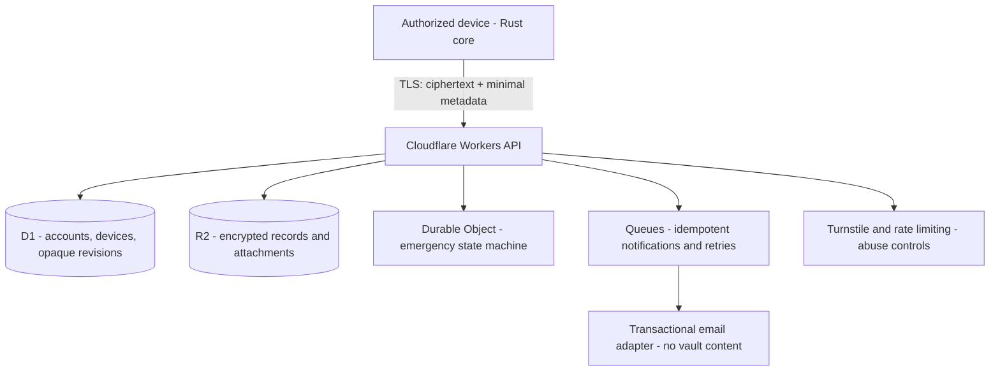

# Cloudflare Infrastructure Plan

Cloudflare is a ciphertext transport/storage and policy-coordination layer. It is not part of the vault decryption boundary.

## Rules

- Workers never contain vault decryption logic.
- D1 stores only operational metadata listed in `docs/security/server-visible-metadata.md`.
- R2 stores ciphertext only.
- Durable Objects are reserved for race-sensitive state, initially emergency access.
- Queue consumers are idempotent and use dead-letter handling where appropriate.
- Email templates contain security-event descriptions only, never item names or vault values.
- Infrastructure secrets and user vault keys are separate concepts; user vault keys do not belong in Worker Secrets/Secrets Store.
