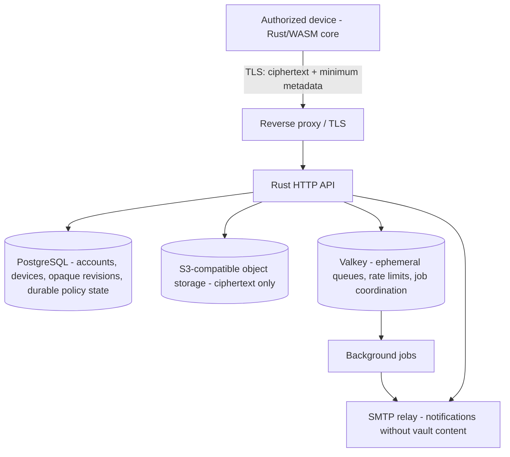

# Self-Hosted Backend Infrastructure

This file keeps its historical name so existing links remain valid. Cloudflare
is no longer a required backend. Safeory's primary server deployment is a
self-hosted Docker stack built from portable services and standard protocols.
Managed cloud hosting can be added later without changing the zero-knowledge
security boundary.

## Primary components

- **Rust HTTP API:** owns authenticated server operations, device registration,
  sync routing, idempotency checks, trusted-person workflows, and emergency
  policy transitions. It has no vault decryption path.
- **PostgreSQL:** authoritative durable store for the server-visible fields
  listed in `docs/security/server-visible-metadata.md`. Race-sensitive policy
  transitions use database transactions/constraints and explicit revision or
  idempotency checks.
- **S3-compatible object storage:** stores encrypted records, attachments, and
  other opaque blobs. **Garage is the preferred self-hosted implementation.**
  MinIO's community distribution is no longer maintained/prebuilt, so it is
  not the default deployment recommendation. The API targets S3 compatibility
  so another implementation or managed object store can be substituted later.
- **Valkey:** handles ephemeral coordination such as rate-limit counters,
  retryable work queues, deduplication windows, and worker wakeups. Valkey is
  never the sole durable record of an authorization, revocation, emergency
  release, or other security-sensitive state transition.
- **SMTP:** delivers verification and security-event notifications. Messages
  contain no vault item names, values, attachments, recovery secrets, or keys.
- **Reverse proxy/TLS:** provides HTTPS ingress, certificate management,
  request-size limits, security headers, and coarse abuse controls. Safeory
  does not require a particular proxy implementation.

## Zero-knowledge rules

- The API never receives usable vault decryption keys, per-item keys, recovery
  secrets, or plaintext vault bodies.
- PostgreSQL contains operational metadata only. Fields that are not required
  to authenticate, route, synchronize, rate-limit, audit, or enforce a policy
  remain encrypted client-side.
- Object storage contains ciphertext only.
- Valkey receives only ephemeral operational identifiers/counters/job metadata;
  secret-bearing vault plaintext is prohibited from queues and caches.
- SMTP templates contain account/security event descriptions only.
- Reverse-proxy and application logs must exclude authorization secrets,
  ciphertext request bodies, recovery material, and vault content.

## Deployment direction

The first deployment target is Docker on infrastructure controlled by the
operator. A later hosted Safeory service or deployment on public-cloud managed
PostgreSQL/S3/cache/email products is optional. Those variants must implement
the same HTTP/object-storage contracts and must not expand server-visible vault
data.
